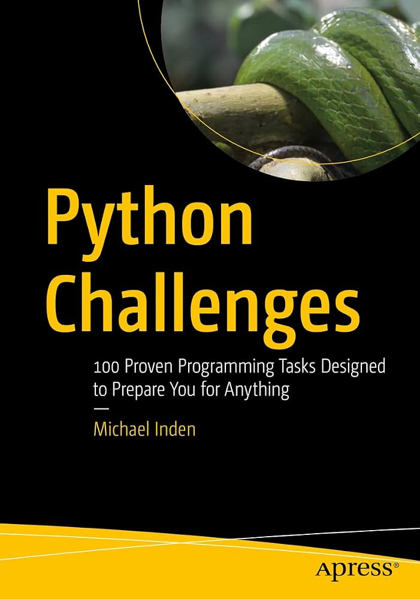

#### Python Challenges: 100 Proven Programming Tasks Designed to Prepare You for Anything 

    

    <a link="https://www.amazon.com.br/Python-Challenges-Programming-Designed-Anything/dp/1484273974">📔 Amazon</a>
    |
    <a link="https://link.springer.com/book/10.1007/978-1-4842-7398-2">🔗 Springer Nature Link</a>

    <table>
    <caption style="font-weight:bold;">Part I: Fundamental</caption>
    <tr>
        <th> Content </th>
        <th> Check </th>
    </tr>
    <tr>
        <td>CHAPTER 2: Mathematical Problems</td>
    </tr>
    <tr>
        <td>1a: Basic Arithmetic Operations (★✩✩✩✩) </td>
        <td>✅</td>
    </tr>
    <tr>
        <td>1b: Statistics (★★✩✩✩) </td>
        <td>✅</td>
    </tr>
    <tr>
        <td>1c: Even or Odd Number (★✩✩✩✩) </td>
        <td>✅</td>
    </tr>
    <tr>
        <td>2: Number as Text (★★✩✩✩) </td>
        <td>✅</td>
    </tr>
    <tr>
        <td>3: Perfect Numbers (★★✩✩✩) </td>
        <td>✅</td>
    </tr>
    </table>

